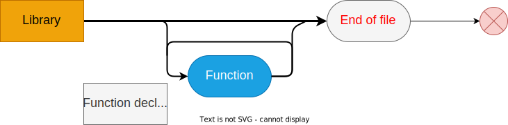
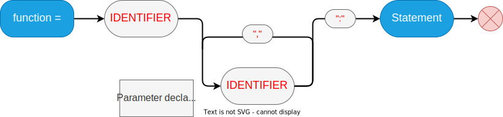
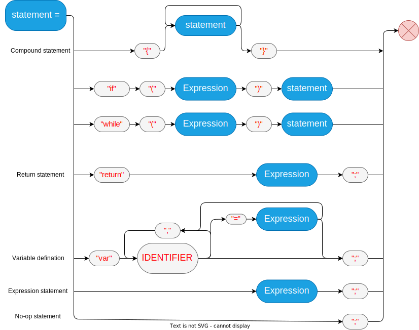
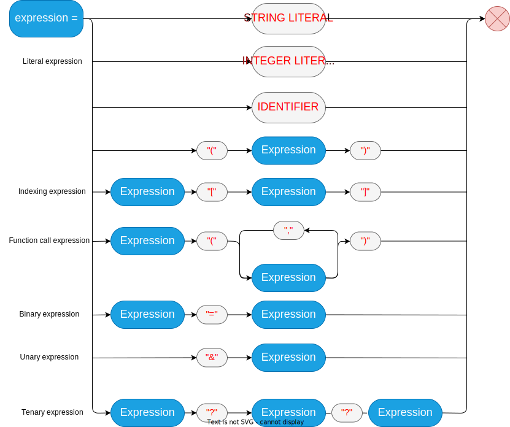

# Formalization
| Identifier | Keyword | Literal | Operator | Separator |
|------------|---------|---------|----------|----------|
| **User defined**| *if, while, return* | *var* | <, > ,= , ?, &, &&, \|\|, !, !=, --, ++, ==, +, -, *, / | () [] {} , ; : ? |
| End of file (EOF) |||||

# Grammar spec

## 1. Grammar specification

## 2. Function Graph

## 3. Statement

## 4. Expression

